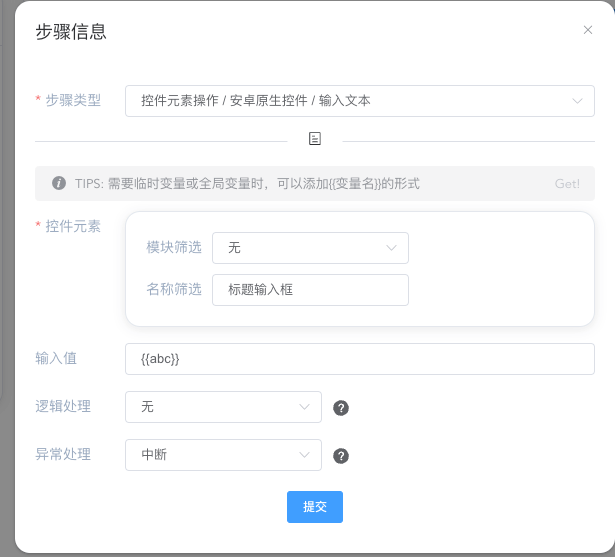

---
contributors:
- 'ZhouYixun'
---

# Advanced Teaching

This page uses **Note App** as an example to introduce how to use advanced UI automation functions.

## Global parameters
When our simple UI automation use case is completed, some of our input parameters need to be extracted for maintenance.

1. Go to the [Global Parameters] page and add new global parameters. For example, the parameter name is abc, and the content is 123456
2. Adjust the input content in the original input step to the new global parameter

::: v-pre
When we deliver the test task, we will find that {{abc}} will be replaced with 123456
:::

::: tip tip
If you want the same parameter name to have different values when distributed to different devices, you can check [Special Usage](https://sonic-cloud.cn/en/doc/doc-global.html#special-usage)

Currently global parameters are available for:
- Control information
- Application name, package name
- enter text
- WebView name
- Handle name
- etc...

During the test, results such as [Get Text] can also be stored in temporary parameters, and can be referenced in the same way later to achieve the effect of parameter passing.
:::

## Public steps

When our multiple use cases contain repeated steps, we can extract them as common steps for maintenance.

::: tip tip
For details, please refer to [Public Procedure Documentation](https://sonic-cloud.cn/en/doc/doc-pub.html)
:::

## Cooperate with Jenkins plugin

If you want Jenkins to build the apk or ipa package, it can be automatically uploaded to the Sonic platform for batch installation and testing, you can use sonic-ci-helper-plugin

::: tip tip
For details, please refer to [sonic-ci-helper-plugin documentation](https://sonic-cloud.cn/sch/re-sch.html)
:::

## Conclusion

The simple advanced teaching is here. For more interesting functions such as custom scripts, iterating control lists, switching WebViews, etc., you can go to [Test Steps Related] to view, and you can use them as needed. May Sonic bring you a friendly experience.

::: tip
For more questions, please go to 👉[Community](https://sonic-cloud.wiki)👈 to communicate
:::
