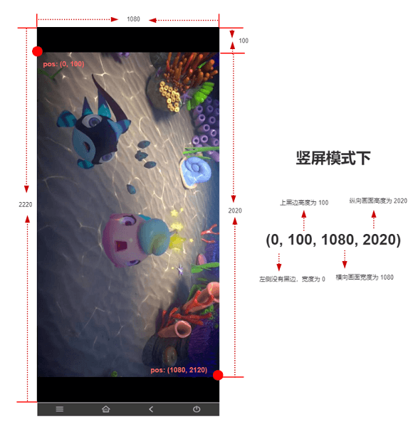

---
contributors:
- 'ZhouYixun'
---

# POCO elements

Precautions and teaching of steps related to using POCO elements.

## Precautions and introduction

The engines currently supported by Sonic for game automation are:

1. Unity3D
2. UE4
3. Egret
4. Cocos2dx-js
5. Cocos2dx-lua
6. Cocos2dx-c++
7. cocos-creator

::: tip note
When accessing POCO-SDK, if you change the default socket startup port, you can specify the value of the connection port in the [Start PocoDriver] step.
:::

When using POCO-related steps, make sure that:

1. The tested element type is a game element
2. The corresponding game package has been connected to POCO-SDK. 👉[POCO Official Access Guide](https://poco.readthedocs.io/en/latest/source/doc/integration.html)
3. The corresponding engine page connected to the SDK has been opened.

## POCO positioning syntax

The default properties of poco elements are as follows:

```java
         private String layer;
         private String name;
         private String tag;
         private String text;
         private String texture;
         private Integer _instanceId;
         private Integer_ilayer;
         private String type;
         private Boolean visible;
         private ZOrders zOrders;
         private List<String> components;
         private List<Float> anchorPoint;
         private List<Float> scale;
         private List<Float> size;
         private List<Float> pos;
         private Boolean clickable;

         public class ZOrders{
             private Integer global;
             private Integer local;
         }
```

POCO game elements currently support three positioning methods:

1. poco type
2. xpath type
3. cssSelector type

### poco type positioning

When positioning, it needs to start with poco, such as:

```python
poco("Hello")
```

You can fill in the attribute value in the parentheses after poco to filter. If you don't fill in the attribute value, the name field will be searched by default. like:

```python
poco(type="Button", name="Hello")
poco(_instanceId=123)
poco(visible=true)
```

After poco, child can be connected to search the child element list. By default, the first result is searched. If the array index is specified, the element subscripted by the array index will be obtained. When the child element array length is less than index, the last digit will be automatically obtained. like:

```python
poco(type="Button", name="Hello").child(text="Star")[1]
```

### xpath type positioning

Just use the same syntax as ordinary xpath, such as:

```bash
//*[@text="Hello" and @type="button"]
```

### cssSelector type positioning

Just use the same syntax as ordinary cssSelector, such as:

```css
Root > Camera > Button > Text
```

## About non-full screen application positioning offset

Some applications do not support full-screen display, resulting in black borders and positioning deviation.

Sonic has been compatible with the non-full-screen offset of most models automatically. If the automatic compatibility effect is not friendly enough:

1. Close the **virtual keyboard** of the phone first, and check whether the application can occupy the full screen.
2. If the black border still appears, you can use the [Set Offset] step.

## Offset setting

The offset setting has four values, which are:

1. offsetWidth
2. offsetHeight
3. windowWidth
4. windowHeight

Its representative content is described in the following figure:



For example, the resolution is 1080x2220, the height of the upper black border is 100px, the height of the screen is 2020px, and the height of the bottom black border is 100px, so the four values are (0, 100, 1080, 2020)
