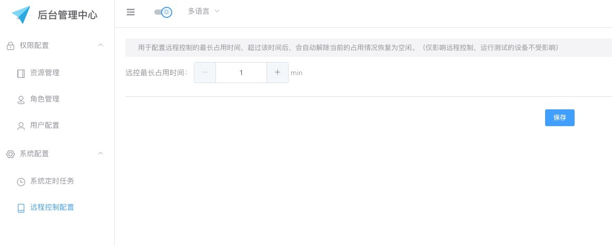
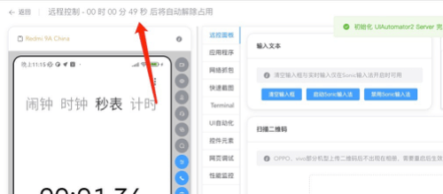

---
contributors:
- 'ZhouYixun'
---

# Automatic and forced unoccupied

::: tip note
This function needs to be upgraded to v2.3.0
:::

## Automatically unoccupied

1. You can go to the background management center to configure the timeout period (the default is 480 minutes, which is eight hours), **does not affect the device under test, only affects the remote control device**.

2. You can see the automatic release time on the remote control page, and the remote control page will automatically close after the timeout.

## Force unoccupied

1. When the device is in the state of [occupied], you can click the status label to open the pop-up window for operation

2. Authentication is enabled by default for this function, and only the hypervisor can use it. Of course, you can also assign permissions through [Role Management], and then assign roles to users to realize that some users also have this permission.

