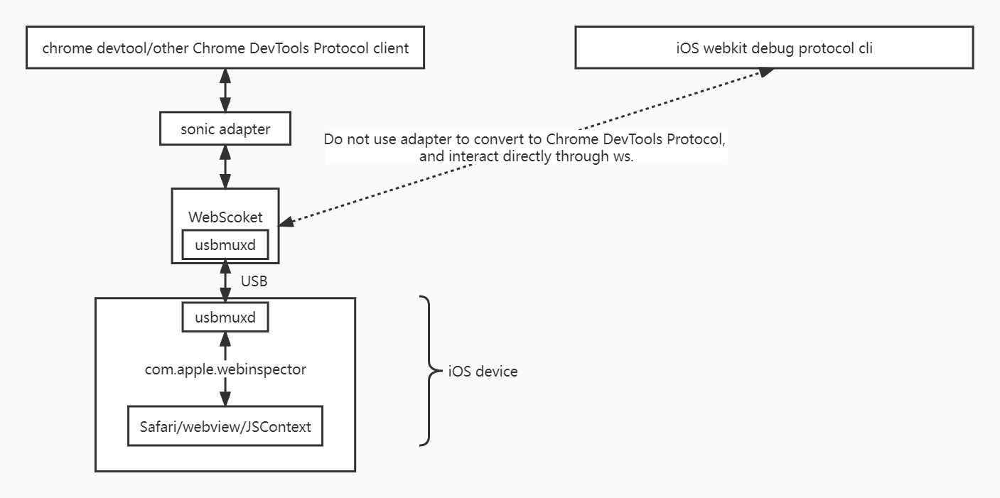

---
contributors:
  - 'aoliaoaoaojiao'
  - 'ZhouYixun'
---

# sonic-ios-webkit-adapter

本文为用于谷歌浏览器调试的 webkit 协议接收器 sonic-ios-webkit-adapter 的介绍与原理简述。 👉[Github 地址](https://github.com/SonicCloudOrg/sonic-ios-webkit-adapter)

<div style="display: flex">


</div>

## 本仓库贡献者

<a href="https://github.com/SonicCloudOrg/sonic-ios-webkit-adapter/graphs/contributors">
  
</a>

## 介绍

**sonic-ios-webkit-adapter** 用作 iOS H5 自动化的底层框架，如 auto touch、性能采集等，
以及提供给前端一个开源易用的 iOS webdebug tool，而如果不使用 adapter，则是暴露原生的 iOS webkit ws 服务，
可以通过 iOS webkit debug tool 工具进行调试（参考： [webkit-webinspector](https://github.com/p0358/webkit-webinspector) ），在后续版本中，我们将会对 devtool 进行二次开发，完善 sonic 的 H5 自动化前端。

## 快速使用

```bash
go get -u github.com/SonicCloudOrg/sonic-ios-webkit-adapter
```

## iOS web 测试基础原理浅谈

当前的主流 H5 调试，基本上都是基于浏览器开放的 debug ws 服务来进行的。我们通过连接这些 ws，然后发送对应的协议过去，即可达到 debug 的目的，例如 iOS 获取 elements，则需要按照协议通过 ws 发送 getDocument 方法到 webkit 里面，等待 ws server 返回对应的 element 信息。iOS 的 webkit protocol 详细可参考：[WebKit/Source/JavaScriptCore/inspector/protocol at main · WebKit/WebKit · GitHub](https://github.com/WebKit/webkit/tree/main/Source/JavaScriptCore/inspector/protocol) ，里面通过划分域的形式，已经将协议分为主要的 20-30 个文件。

## 如何开启 iOS web debug 服务？

不同于安卓只需要简单的去开发者模式里开启 webview 的 debug 模式，iOS 由于其封闭性，开启 web debug 非常麻烦。我们需要发送相关的 DTX 协议给 iOS 内置的 com.apple.webinspector（参考:[sonic-gidevice/webinspector.go at main · SonicCloudOrg/sonic-gidevice · GitHub](https://github.com/SonicCloudOrg/sonic-gidevice/blob/main/webinspector.go) 、[sonic-ios-bridge/src/webinspector at main · SonicCloudOrg/sonic-ios-bridge · GitHub](https://github.com/SonicCloudOrg/sonic-ios-bridge/tree/main/src/webinspector) ）。

大体流程如下：通过 gidevice 启动相关的 webinspector server 方法，随后 DTX 发送对应的**connect id**到 webinspector，

这时候会返回对应的 DTX 信息，我们会根据 DTX 信息的 case 标志(Selector 参数)进行 webinspector client 的初始化处理。

该过程中会得到当前设备中的 webkit**应用 pid 和 base page 信息**（根据一些技术文章，如果 iOS 的应用有 developer 证书，则可以开启 H5 调试，后续开发维护时会进行验证其真实性）。根据这些 pid 和 page 信息，当需要对某个 webkit 应用进行 web debug 时，创建一个**senderid**，并将其发送到 webinspector 中，**让 webkit 开启 debug 服务**，我们只需要发送相关的协议信息就行。

## 协议兼容

虽然 iOS 的 webkit inspector 是发展最早的一个网页调试器，但是由于 iOS 的封闭性和其他的一些因素，后续的其他内核的浏览器调试并没有使用 iOS 的 webkit 调试协议，基于易用性考虑，sonic 参考[google/ios-webkit-debug-proxy](https://github.com/google/ios-webkit-debug-proxy) 、[RemoteDebug/remotedebug-ios-webkit-adapter](https://github.com/RemoteDebug/remotedebug-ios-webkit-adapter) 这两个项目，用 golang 重写了一遍，只需要使用 sib 的 webinspector adapter 模式，即可通过 chrome devtool 简单调试 iOS 的 safari。核心思路是 sib 将发送协议信息这个关键步骤做成 ws 服务，采用双向代理的模式，通过[SonicCloudOrg/sonic-ios-webkit-adapter](https://github.com/SonicCloudOrg/sonic-ios-webkit-adapter) **拦截 iOS webkit 调试协议和 Chrome DevTools Protocol 协议之间的特异方法，将其转换成双方可接受的调试协议和返回结果**。

### 案例

如果我们需要获取当前页面下导航栏中的历史信息时，Chrome DevTools Protocol 的做法是 ws 里发送 Page 域中的 getNavigationHistory 方法到当前调试的应用中，等待返回的结果就行。比较可惜的是，这个方法直接发送到 iOS webkit 中，iOS webkit 会返回信息告知并没有这个方法，不过 iOS webkit 可以通过曲线救国的方式达到类似的效果。首先，我们先看 Chrome DevTools Protocol 中 getNavigationHistory 的返回信息是什么（参考：[Chrome Devtools Protocol](https://github.com/ChromeDevTools/devtools-protocol/blob/master/json/browser_protocol.json) ）

```bash
    {
        "id": "TransitionType",
        "description": "Transition type.",
        "type": "string",
        "enum": [
            "link",
            "typed",
            "address_bar",
            "auto_bookmark",
            "auto_subframe",
            "manual_subframe",
            "generated",
            "auto_toplevel",
            "form_submit",
            "reload",
            "keyword",
            "keyword_generated",
            "other"
        ]
    }

    {
        "name": "getNavigationHistory",
        "description": "Returns navigation history for the current page.",
        "returns": [
            {
                "name": "currentIndex",
                "description": "Index of the current navigation history entry.",
                "type": "integer"
            },
            {
                "name": "entries",
                "description": "Array of navigation history entries.",
                "type": "array",
                "items": {
                    "$ref": "NavigationEntry"
                }
            }
        ]
    }


    {
        "id": "NavigationEntry",
        "description": "Navigation history entry.",
        "type": "object",
        "properties": [
            {
                "name": "id",
                "description": "Unique id of the navigation history entry.",
                "type": "integer"
            },
            {
                "name": "url",
                "description": "URL of the navigation history entry.",
                "type": "string"
            },
            {
                "name": "userTypedURL",
                "description": "URL that the user typed in the url bar.",
                "type": "string"
            },
            {
                "name": "title",
                "description": "Title of the navigation history entry.",
                "type": "string"
            },
            {
                "name": "transitionType",
                "description": "Transition type.",
                "$ref": "TransitionType"
            }
        ]
    }
```

由返回结构可知，最重要的是 url 和 titile（其他信息可自定义生成），所以思路可以这样：

通过中间层拦截到这个特异性的方法，然后将这个方法替换成 iOS webkit protocol 下 Runtime 域的 evaluate 方法（evaluate 方法的使用说明参考：[iOS webkit protocol Runtime](https://github.com/WebKit/WebKit/blob/main/Source/JavaScriptCore/inspector/protocol/Runtime.json)），发送 window.location.href，获取全局 windows 对象下的 location.href 结果，然后再次使用 Runtime 域 evaluate 方法，发送 window.title，获取全局 windows 对象下的 title 结果，然后按照 getNavigationHistory 的返回结构组合获取到的这些信息，再返回到 devtool 中。

### 大体设计



### 不同调试协议之间的[API 差异](http://compatibility.remotedebug.org/) 概览


